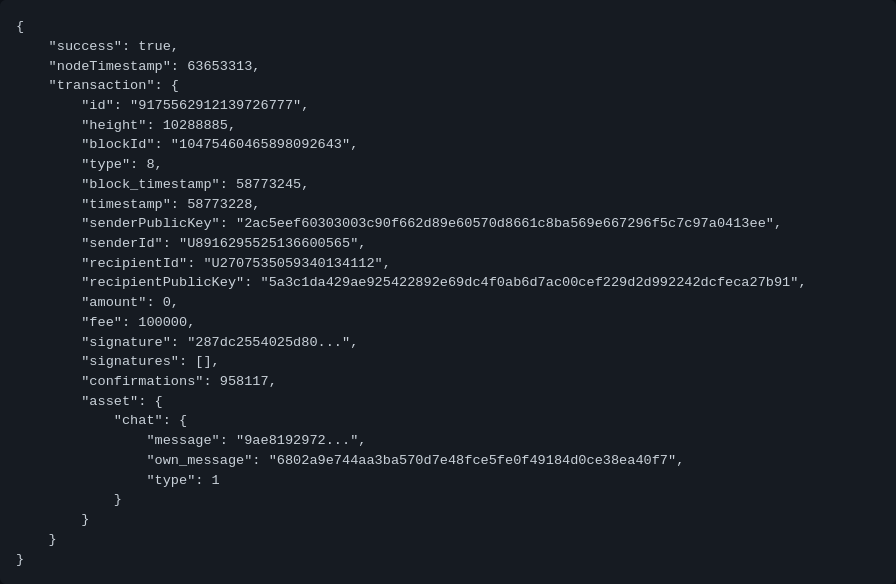
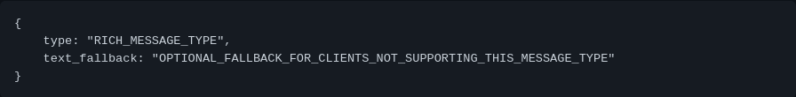
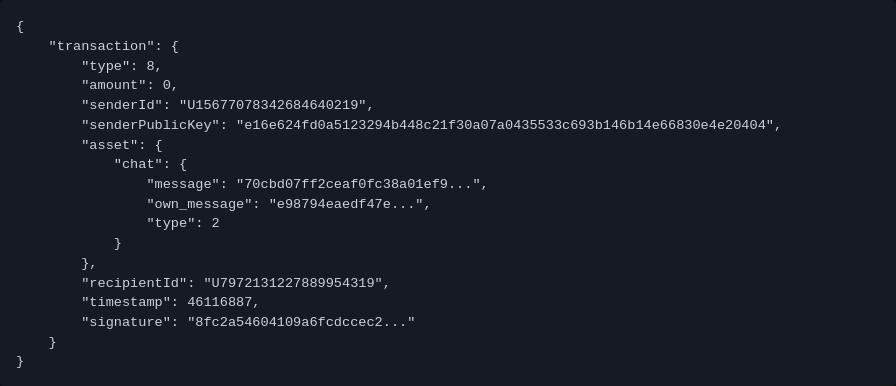
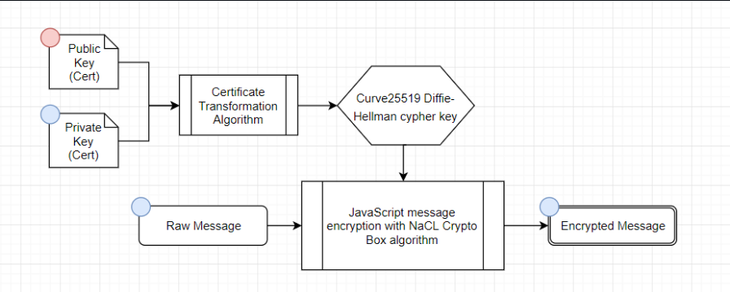
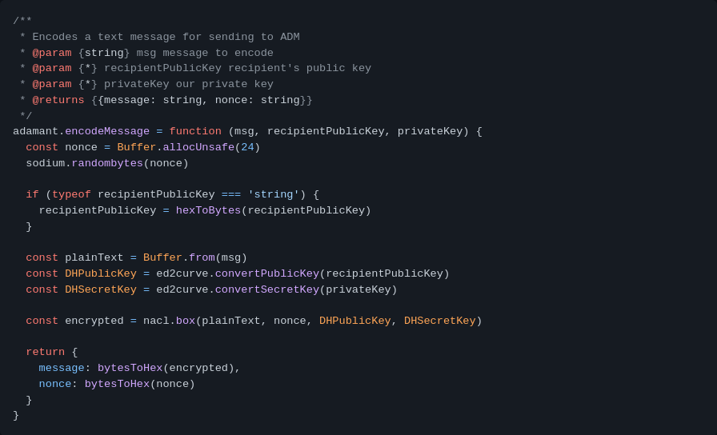
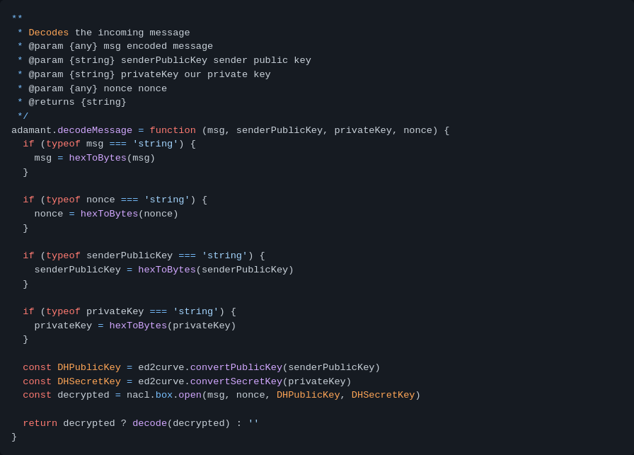

# Rapport Projet SSI : Présentation du chiffrement dans ADAMANT Messenger 

## Chapitre 1 : Présentation de l'application Adamant.

 
## Chapitre 2 : Le chiffrement dans l'application Adamant.

### Partie 1 : chiffrement des Comptes

### Partie 2 : chiffrement des Messages

### 2.2.1 Types Des messages:

#### 2.2.1.1 Basic Encrypted Messages:
Basic Encrypted Message est une simple transaction de message crypté  sous form JSON qui inclut les champs message et own_message.

En plus de l'envoi d'un message, Basic Encrypted Message peut être utilisé pour transférer des Token ADM. Ajoutez un nombre entier de  Tokens ADM dans le champ “amount” de transaction pour effectuer un transfert de Token. Dans ce cas, le champ de message sera utilisé comme commentaire pour le transfert ADM.
Example de l'objet JSON:

#### 2.2.1.2 Rich Content Messages:
Le message de contenu enrichi est une transaction de message de contenu spéciale qui doit être traitée par les applications clientes.

Le champ message de l'objet Rich Content Message doit contenir un JSON crypté de texte enrichi comme l'exemple suivant:

Où type est une chaine de caractère décrivant comment gérer le texte enrichi. Le champ text_fallback est facultatif et il peut être ajouté pour afficher le texte d'explication pour  les applications clients qui ne supportent pas le type de message Rich Content Message. Ce JSON peut avoir d'autres champs autre que ceux, seule le type est obligatoire

Example:

#### 2.2.1.3 Signal Messages:

Le message de signal est un message de transaction spéciale qui doit être masquée par les applications clients, mais traitée par les services interne de l'applications. les messages des notifications par exemple.
Les messages de signal doivent être cryptés de la même manière que Basic Encrypted Messages.

### 2.2.1 Cryptage des messages:

La figure suivante donne une vision sur le cycle de vie d'un message dans l'application Adamant.

* Les messages sont cryptés à l'aide de l'algorithme curve25519 xsalsa20 poly1305 (boîte NaCl). Box est créé à l'aide de la clé privée de l'expéditeur et de la clé publique du destinataire.
* La clé publique du destinataire est récupérée du réseau ADAMANT
* privateKey et publicKey des comptes sont des instances de clés de signature Ed25519, elles doivent donc d'abord être converties en clés Diffie-Hellman Curve25519

#### Example de cryptage

#### Example de décryptage

### Partie 3 : chiffrement dans le Stockage des valeurs-clés KVS

### Partie 4 : chiffrement dans la signature des transactions

## Chapitre 3 : Simulation d'un noeud dans le blockchain.
