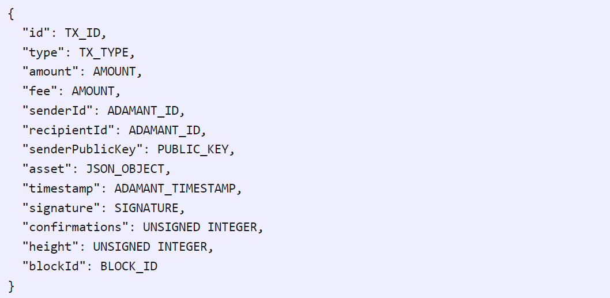
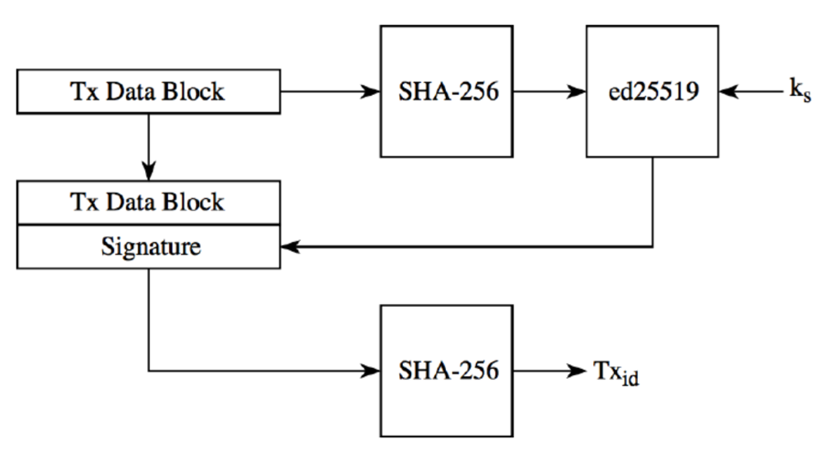

# Rapport Projet SSI : Présentation du chiffrement dans ADAMANT Messenger 

La sécurité est l’une des principales exigences de nos jours, les entreprises s’interrogeant sur des approches innovantes pour protéger les informations. L’une des solutions les plus innovantes qui ont émergé récemment pour aider les entreprises à sécuriser les points d’échange d’informations vers la blockchain. La technologie Blockchain apporte des fonctionnalités de registre distribué et garantit que les parties non autorisées ne peuvent pas voir les informations échangées dans une transaction spécifique.

## Chapitre 1 : Présentation de l'application Adamant.

 
## Chapitre 2 : Le chiffrement dans l'application Adamant.

### Partie 1 : chiffrement des Comptes

### Partie 2 : chiffrement des Messages

### 2.2.1 Types Des messages:

#### 2.2.1.1 Basic Encrypted Messages:
Basic Encrypted Message est une simple transaction de message crypté  sous form JSON qui inclut les champs message et own_message.

En plus de l'envoi d'un message, Basic Encrypted Message peut être utilisé pour transférer des Token ADM. Ajoutez un nombre entier de  Tokens ADM dans le champ “amount” de transaction pour effectuer un transfert de Token. Dans ce cas, le champ de message sera utilisé comme commentaire pour le transfert ADM.
Example de l'objet JSON:

#### 2.2.1.2 Rich Content Messages:
Le message de contenu enrichi est une transaction de message de contenu spéciale qui doit être traitée par les applications clientes.

Le champ message de l'objet Rich Content Message doit contenir un JSON crypté de texte enrichi comme l'exemple suivant:

Où type est une chaine de caractère décrivant comment gérer le texte enrichi. Le champ text_fallback est facultatif et il peut être ajouté pour afficher le texte d'explication pour  les applications clients qui ne supportent pas le type de message Rich Content Message. Ce JSON peut avoir d'autres champs autre que ceux, seule le type est obligatoire

Example:

#### 2.2.1.3 Signal Messages:

Le message de signal est un message de transaction spéciale qui doit être masquée par les applications clients, mais traitée par les services interne de l'applications. les messages des notifications par exemple.
Les messages de signal doivent être cryptés de la même manière que Basic Encrypted Messages.

### 2.2.1 Cryptage des messages:

La figure suivante donne une vision sur le cycle de vie d'un message dans l'application Adamant.

* Les messages sont cryptés à l'aide de l'algorithme curve25519 xsalsa20 poly1305 (boîte NaCl). Box est créé à l'aide de la clé privée de l'expéditeur et de la clé publique du destinataire.
* La clé publique du destinataire est récupérée du réseau ADAMANT
* privateKey et publicKey des comptes sont des instances de clés de signature Ed25519, elles doivent donc d'abord être converties en clés Diffie-Hellman Curve25519

#### Example de cryptage

#### Example de décryptage

### Partie 3 : chiffrement dans le Stockage des valeurs-clés KVS

### Partie 4 :la signature des transactions

#### 4.1 ADAMANT Transaction
Les objets de transaction sont le seul moyen d'écrire des données dans la blockchain ADAMANT.

Toutes les transactions dans la blockchain ADAMANT sont signées avec un algorithme de crypto signation robuste Ed25519 EdDSA

Chaque transaction, quel que soit le type, doit être signée par l'expéditeur avant d'être acceptée par le réseau. Le processus de signature de la transaction est identique pour chaque transaction. 

#### 4.2 Types de transactions
Toute transaction dans ADAMANT a son but et son objet. Bien que toutes les transactions aient une structure générale, il existe certaines particularités entre types.

* 0 est destiné à l'envoi de jetons
* 1 est pour la deuxième signature
* 2 est pour l'inscription des délégués
* 3 est pour le vote
* 4 est pour multisignature
* 8 est destiné à la messagerie (y compris le contenu enrichi) et aux transferts de jetons In-Chat
* 9 est destiné au stockage de données (KVS)

La transaction ADAMANT doit être conforme au schéma JSON :

Les champs suivants doivent être présents dans tous les types de transactions :
* Entier de 8 bits identifiant le type de transaction
* Horodatage d’époque de 32 bits indiquant la date de création de la transaction
* La clé publique 256 bits de l’émetteur de la transaction
* Entier de 64 bits représentant la quantité de jetons à transférer

Les autres champs seront ajoutés à ce schéma en fonction du type de transaction. 

### Le processus de signature de la transaction

Le processus de signature de la transaction est identique pour chaque transaction.

Tout d’abord, un bloc de données représentant la transaction doit être généré. Chaque bloc de données contient un ensemble spécifique d’informations standardisées. Les informations supplémentaires contenues dans le bloc de données diffèrent en fonction du type de transaction.

Une fois le bloc de données généré, il est haché à l’aide de l’algorithme SHA-256, et ce hachage est signé à l’aide de la paire de clés de l’émetteur. 

L’ID de transaction est généré à partir du bloc de données. 

Afin de calculer l’ID de transaction, le système prend le bloc de données avec les informations de signature complétées et hache ce bloc à l’aide de SHA-256 et les 8 premiers octets du hachage sont inversés et qui sont ensuite utilisés comme ID de transaction.

Enfin, une signature de transaction doit être incluse dans l’objet de transaction avant d’être diffusée sur le réseau.

## Chapitre 3 : Simulation d'un noeud dans le blockchain.
